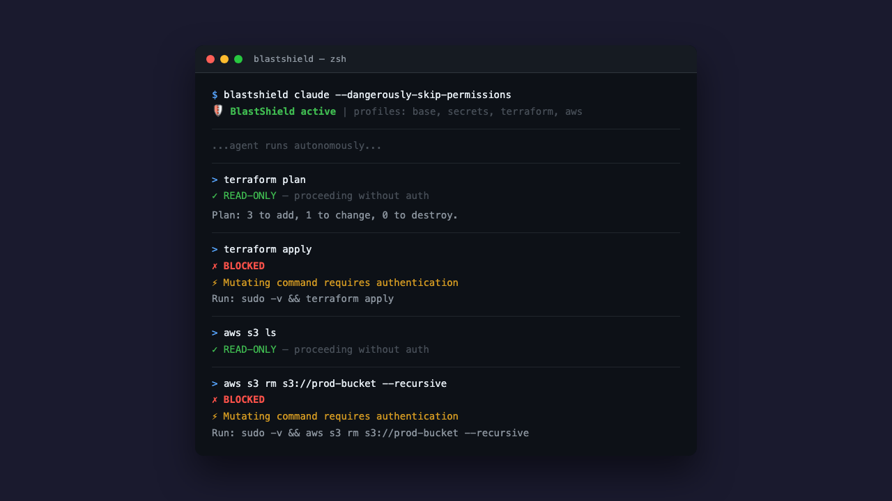

import imageBlakeReid from '@/images/team/blake-reid.jpg'

export const article = {
  date: '2025-04-29',
  title: 'Shrink the Blast Radius',
  description:
    'AI coding agents are fast, capable, and one bad command away from deleting your production database. We built BlastShield so you can let them run without losing sleep.',
  author: {
    name: 'Blake Reid',
    role: 'Founder',
    image: { src: imageBlakeReid },
  },
}

export const metadata = {
  title: article.title,
  description: article.description,
}

## Your AI Agent Has No Chill

You gave an AI agent root access to your cloud and told it to go fast. What could go wrong? Everything. Absolutely everything.

Claude, Codex, Opencode — these tools are extraordinary. They write code, debug issues, and deploy changes at a pace no human can match. But they also run `terraform apply` without blinking, `aws s3 rm --recursive` without asking, and `kubectl delete namespace production` with the confidence of someone who doesn't know what production means.

The result? A single hallucinated command can wipe out state files, nuke databases, or push breaking changes to thousands of users. And the worst part: you won't know until it's already done.



## Read-Only by Default

BlastShield enforces a simple principle: **the agent inspects, you execute.**

Read-only commands — `list`, `describe`, `get`, `plan`, `show` — pass through automatically. The agent can explore, analyze, and plan all day long without supervision. But the moment it tries to mutate something — `terraform apply`, `gcloud deploy`, `aws s3 rm` — the command is blocked dead and bounced back to you.

No configuration files to maintain. No allowlists to update. The guard knows which subcommands are destructive and which aren't. You don't have to think about it.

## Two Layers, Zero Escapes

One layer of defense is a suggestion. Two layers is a guarantee.

**Layer 1: sandbox-exec profiles.** Kernel-level filesystem restrictions that keep the agent away from credential files, SSH keys, cloud configs, and state locks. The agent can't read your AWS credentials. It can't write to your Terraform state. And because sandbox-exec is enforced by the macOS kernel, the agent can't bypass it — not through PATH manipulation, not through absolute paths, not through subshells. Child processes inherit the sandbox. No escape.

**Layer 2: command-argument guard.** PATH-based wrappers that intercept every mutating subcommand before it reaches the real CLI. Even if the agent finds the binary, it still has to get past the guard — which requires Touch ID or a password. The agent has neither.

Together, these two layers mean the agent can do its job (read, plan, code) but cannot do damage (apply, delete, deploy) without you.

## It Works With What You Already Use

BlastShield wraps your existing tools. It doesn't replace them.

```
blastshield claude --dangerously-skip-permissions
blastshield codex --full-auto
blastshield opencode
```

That's it. One prefix command and your agent is sandboxed. The agent runs exactly as before — same interface, same capabilities — but with blast protection active.

It also composes with other sandboxing tools like safehouse and agent-seatbelt, because defense in depth isn't just a good idea, it's the only idea that works.

## The Problem Isn't Going Away

AI coding agents are becoming standard tooling. Every week another team hooks up an autonomous agent to their cloud infrastructure and hopes for the best. Hoping is not a strategy.

The blast radius of a compromised or hallucinating agent grows with every new integration. Today it's Terraform. Tomorrow it's your Kubernetes cluster. Next month it's your billing account.

BlastShield is open source, free, and takes about thirty seconds to set up. If you're running AI agents with cloud access and you're not using it, you're betting your infrastructure on the assumption that an LLM will never make a mistake. That is, to put it mildly, an optimistic position.

[Get started →](https://cdrxyz.github.io/blastshield/getting-started/)
